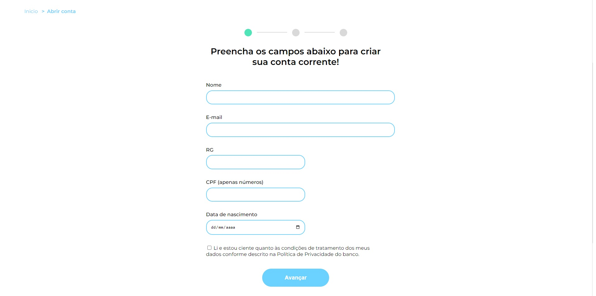

<h1 align="center"> MoniBank </h1>

Um projeto com o intuito de treinar validações de formulário,
criando validações customizadas para cada campo

 

  

## ✔ Tecnologias

Esse projeto foi desenvolvido com as seguintes tecnologias:

- HTML e CSS
- JavaScript
- Git e Github

## 💻 Projeto

O projeto simula a criação de conta em um banco ficticio.

- [Visite o projeto online] (https://patrickpicon.github.io/validacoes_com_formulario/)
